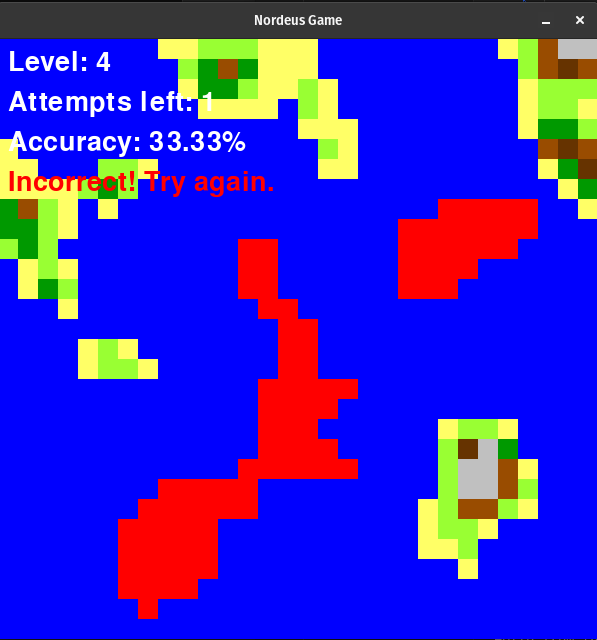

# Island Guessing Game

In this game, the player needs to guess the island with the highest average height.

## Requirements

Make sure to use a virtual environment for the project. If you don't have one, create it and install the dependencies:

1. Create a virtual environment:
   ```
   python3 -m venv venv
   ```

2. Activate the virtual environment:
   - macOS/Linux:
     ```
     source venv/bin/activate
     ```
   - Windows:
     ```
     venv\Scripts\activate
     ```

3. Install the required libraries:
   ```
   pip install -r requirements.txt
   ```

## Running the Game

To play the game, simply run:

```
python3 src/main.py
```

Good luck and have fun!

